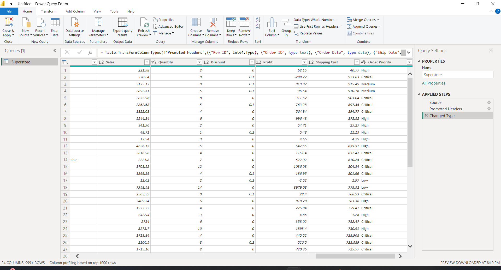
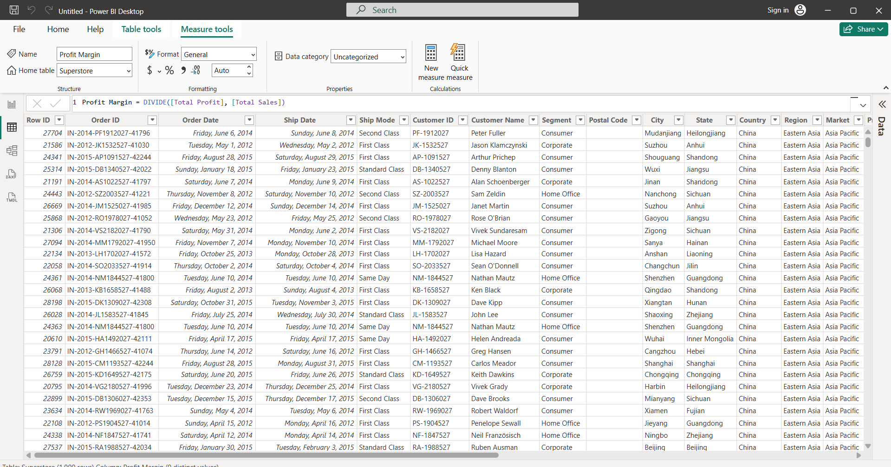
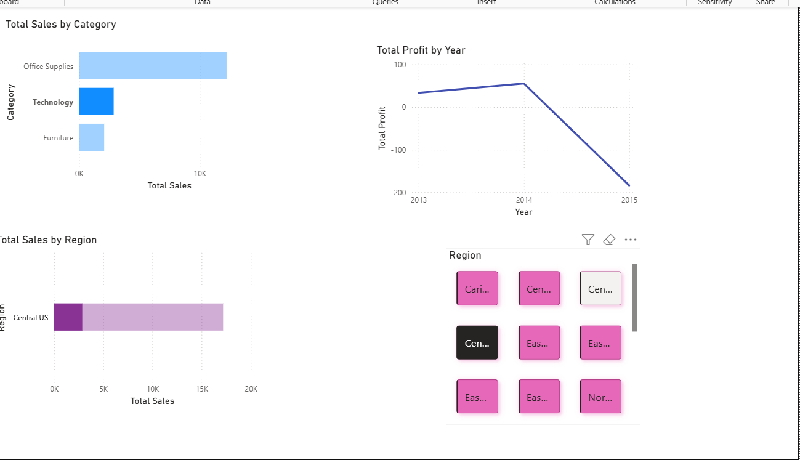
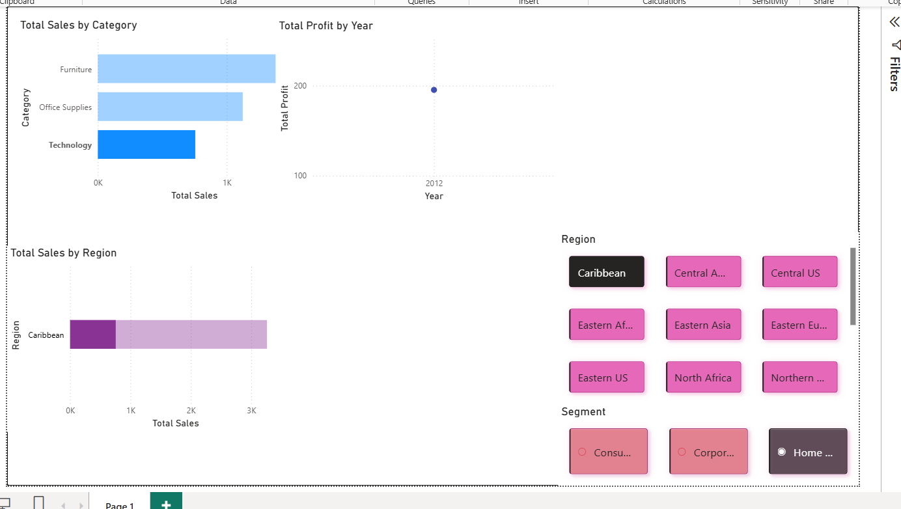
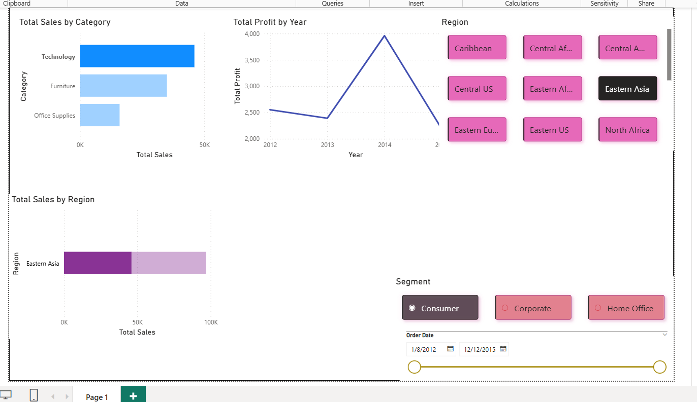

# 📊 Data Analyst Internship – Task 7  
## Power BI Mini Dashboard (Beginner)

This repository contains my submission for **Task 7** of the Data Analyst Internship.  
In this task, I created an **interactive Power BI dashboard** using the **Global Superstore dataset** to analyze sales and profit performance.

---

## 🛠 Tools Used

- Power BI Desktop  
- Microsoft Excel (for initial data checking)  
- GitHub (documentation & submission)

---

## 📂 Dataset

- **Global Superstore Dataset**
- Includes information on:
  - Sales
  - Profit
  - Category
  - Region
  - Segment
  - Order Date

This dataset is widely used for practicing **business intelligence and data analytics**.

---

## 🎯 Dashboard Objectives

- Calculate **Total Sales**, **Total Profit**, and **Profit Margin**
- Analyze **Sales by Category**
- Analyze **Sales by Region**
- Track **Profit Trend Over Time**
- Enable interactive filtering using slicers

---

## 🔄 Data Preparation

### Dataset Loaded

### Dataset Preview

### Power Query Editor
Used Power Query to check data types and clean columns.

### Table Renamed

---

## 🧮 DAX Measures Created

- **Total Sales**
- **Total Profit**
- **Profit Margin**

### Total Sales Measure

### Total Profit Measure

### Profit Margin Measure

---

## 📌 KPI Cards

### Total Sales KPI

### Total Profit KPI

### Profit Margin KPI

---

## 📈 Visualizations

### Sales by Category

### Sales by Region

### Profit Trend Over Time

---

## 🎛 Interactive Slicers

### Region Slicer

### Segment Slicer

### Year Slicer

---

## 🧩 Final Dashboard Layout

---

## 📄 Deliverables

- `Dashboard.pbix` – Power BI file  
- `Dashboard.pdf` – Exported dashboard  
- Screenshots of all steps  
- `README.md` – Project documentation  

---

## 🔍 Key Learnings

- Understanding **KPIs** and their importance
- Difference between **Measures and Calculated Columns**
- Using **DAX** for business calculations
- Designing **interactive dashboards** using slicers
- Creating a **professional GitHub project** for data analytics work

---

## ✅ Conclusion

This project helped me build a strong foundation in **Power BI dashboard creation**, **data analysis**, and **business reporting**, which are essential skills for a **Data Analyst role**.

